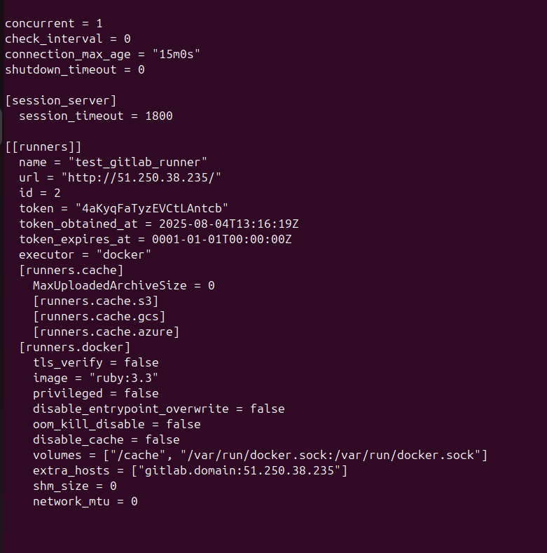
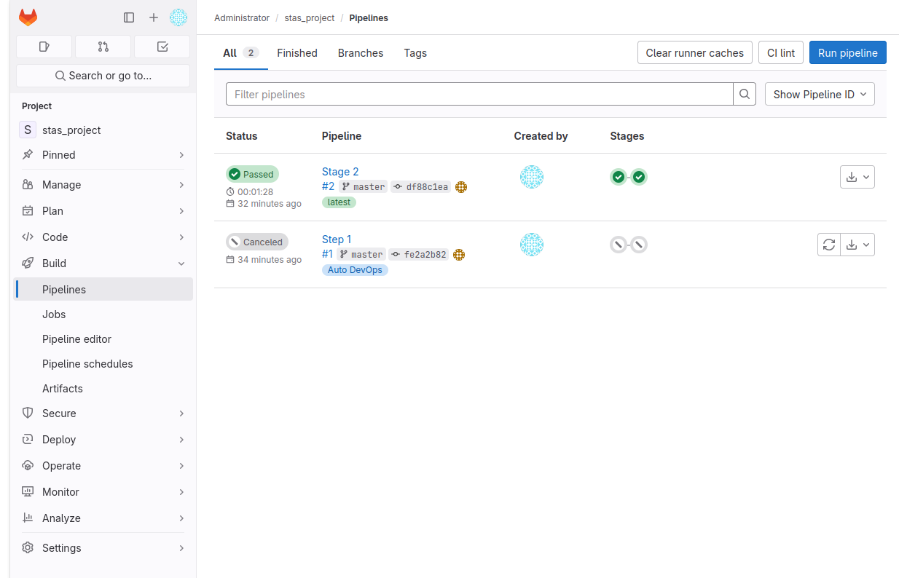

# Домашнее задание к занятию "`GitLab`" - `Кутейкин Станислав`

ЗДРАВСТВУЙТЕ
---

### Задание 1

`Приведите ответ в свободной форме........`

1. `Разверните GitLab локально, используя Vagrantfile и инструкцию, описанные в этом репозитории.`
2. `Создайте новый проект и пустой репозиторий в нём.`
3. `Зарегистрируйте gitlab-runner для этого проекта и запустите его в режиме Docker. Раннер можно регистрировать и запускать на той же виртуальной машине, на которой запущен GitLab.`

Поле для вставки кода...



### Задание 2

`Приведите ответ в свободной форме........`

1. `Запушьте репозиторий на GitLab, изменив origin. Это изучалось на занятии по Git.`
2. `Создайте .gitlab-ci.yml, описав в нём все необходимые, на ваш взгляд, этапы.`

Поле для вставки кода...

```
stages:
  - test
  - build

test:
  stage: test
  image: golang:1.17
  script: 
   - go test .
  tags:
   - netology-stas

build:
  stage: build
  image: docker:latest
  script:
   - docker build .
  tags: 
   - netology-stas
```

`При необходимости прикрепитe сюда скриншоты`


---

### Задание 3

----------------
Измените CI так, чтобы:

этап сборки запускался сразу, не дожидаясь результатов тестов;
тесты запускались только при изменении файлов с расширением *.go.
В качестве ответа добавьте в шаблон с решением файл gitlab-ci.yml своего проекта или вставьте код в соответсвующее поле в шаблоне
----------------

ВОТ КОНФИГ ФАЙЛ

```
stages:
  - test
  - analyze
  - build

test:
  stage: test
  image: golang:1.17
  script: 
   - go test .
  rules:
   - changes:
      - '**/*.go'
  tags:
   - netology-stas

static-analysis:
  stage: analyze
  image:
    name: sonarsource/sonar-scanner-cli
    entrypoint: [""]
  script:
   - sonar-scanner -Dsonar.projectKey=my_project -Dsonar.sources=. -Dsonar.host.url=http://gitlab.domain:9000 -Dsonar.login=********
  tags:
   - netology-stas
 
build:
  stage: build
  image: docker:latest
  script:
   - docker build .
  needs: [] 
  tags: 
   - netology-stas
```

В общем это задание получилось наполовину, тк были проблемы с sonarqube и пришлось несколько раз перезапускать ВМ из-за чего ее белый адрес менялся, пошли конфликт с настройками и ссылками на репозиторий на gitlab-бе, это надо заново все пересобирать. Для того, чтобы сборка начиналась раньше тестов надо использовать " needs: [] ", для того, чтобы тест начинался только при измении go файлов надо использовать:

 ```
 rules:
   - changes:
      - '**/*.go' 
```

Все понятно в принципе, все есть в официальной документации, единственное не добился как поменялся публичный адрес, чтоб корректно все отрабатывалось, где-то в конфига надо переобъявить переменные скорее всего. Если надо будет для этого задания, переподниму все. В принципе когда подразбираешься в то, как это ручками делать, становится быстрее весь процесс

СПАСИБО ЗА ПРОВЕРКУ!
